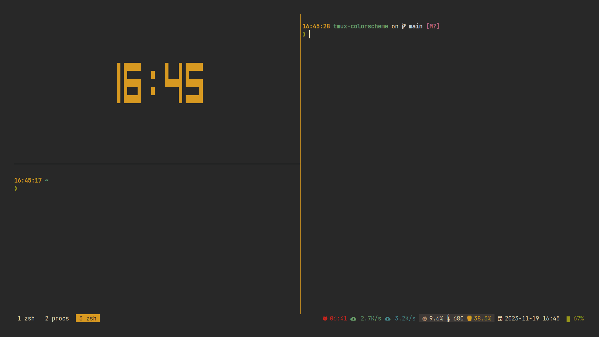

# Colorscheme theme configuration for Tmux


## Installation
### Install manually

1. Copy your desired theme's configuration contents into your Tmux config (usually stored at ~/.tmux.conf)
1. Reload Tmux by either restarting the session or reloading it with tmux source-file ~/.tmux.conf

### Install through [Tmux Plugin Manager](https://github.com/tmux-plugins/tpm)

Add plugin to the list of TPM plugins in `.tmux.conf` and select desired theme

```bash
set -g @plugin 'l-lin/tmux-colorscheme'
set -g @tmux-colorscheme 'kanagawa' # or 'gruvbox'
set -g @tmux-colorscheme-background 'dark' # or 'light'
```

Hit `prefix + I` to fetch the plugin and source it. Your Tmux should be updated with the theme at this point.

## Gruvbox

Theme with 'retro groove' flavor for [Tmux](https://github.com/tmux/tmux), based on Pavel Pertsev's [Gruvbox colorscheme](https://github.com/morhetz/gruvbox).

### Dark (default)

```tmux
set -g @plugin-colorscheme-background 'dark'
```



### Light

```tmux
set -g @plugin-gruvbox-background 'light'
```


## Plugin support
### [tmux-netspeed](https://github.com/wfxr/tmux-net-speed)

```tmux
set -g @tmux-colorscheme-show-upload-speed true
set -g @tmux-colorscheme-show-download-speed true
```

### [tmux-prefix-highlight](https://github.com/tmux-plugins/tmux-prefix-highlight)

```tmux
set -g @tmux-colorscheme-show-prefix-highlight true
```

### [tmux-plugins/tmux-battery](https://github.com/tmux-plugins/tmux-battery)

```tmux
set -g @tmux-colorscheme-show-battery true
```

### [tmux-pomodoro-plus](https://github.com/olimorris/tmux-pomodoro-plus)

```tmux
set -g @tmux-colorscheme-show-pomodoro true
```

